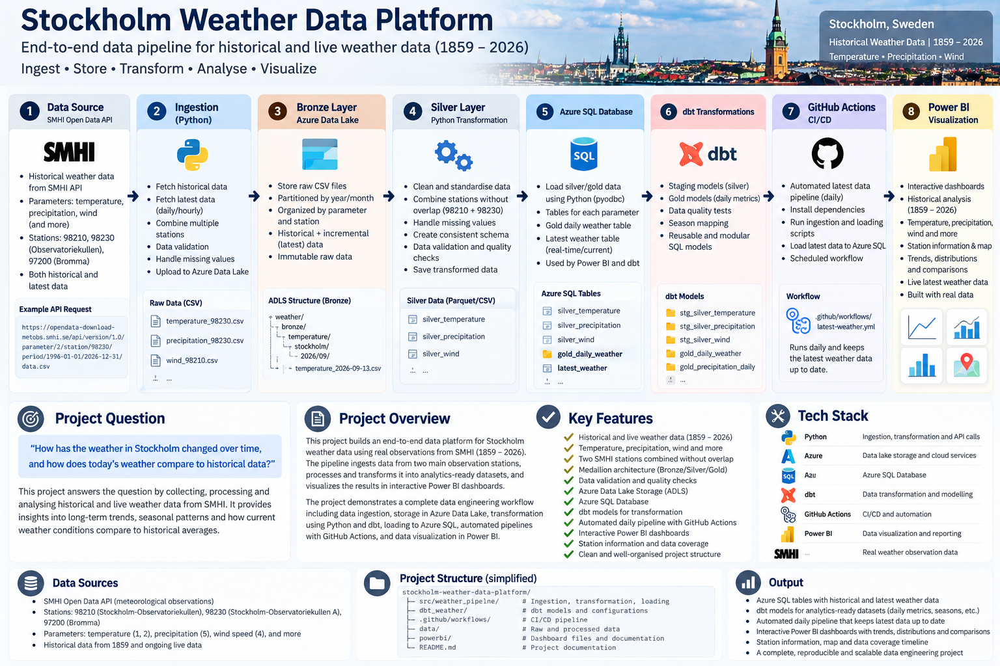
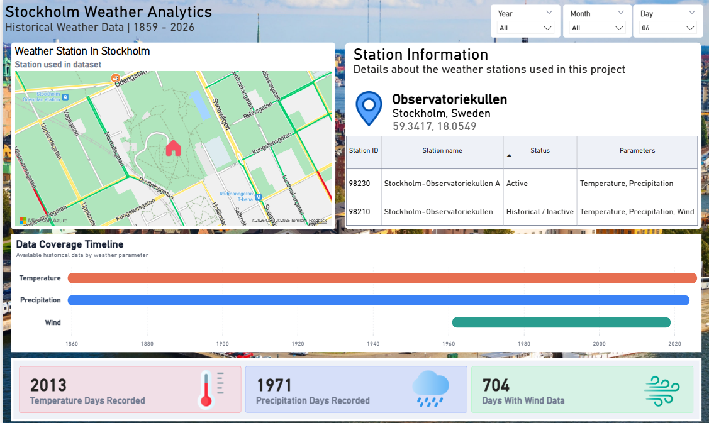
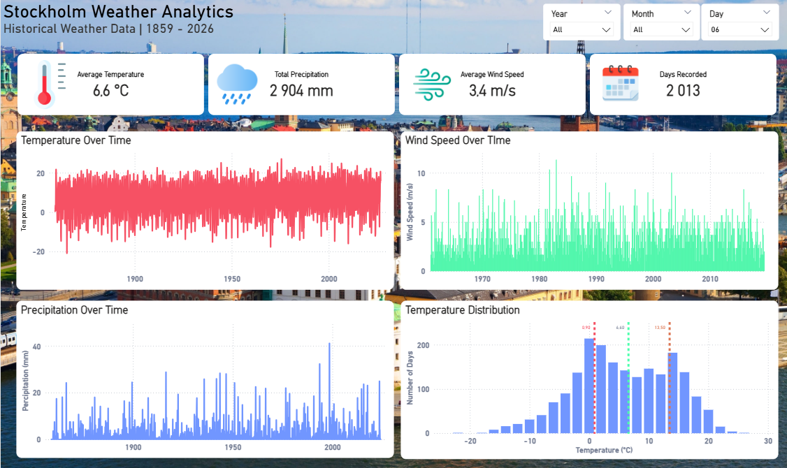

# Stockholm Weather Data Platform

An end-to-end data engineering project for collecting, processing, modelling and visualizing historical and live weather data for Stockholm, Sweden.

The platform uses real meteorological observations from SMHI and combines Python, Azure Data Lake, Azure SQL, dbt, GitHub Actions and Power BI into a complete data pipeline.

Historical observations extend back to **1859**, while a separate automated pipeline continuously retrieves the latest available weather observations.

---

## Project Question

> **How has Stockholm’s weather changed over time, and how do current weather conditions compare with historical patterns?**

The project explores this question by combining more than a century of historical observations with current weather measurements.

The analysis focuses primarily on:

- Temperature
- Precipitation
- Wind speed
- Long-term weather trends
- Seasonal patterns
- Temperature distributions
- Historical data coverage
- Current weather compared with historical averages

The objective is not only to answer the analytical question, but also to demonstrate how a modern data engineering architecture can transform raw API data into reliable, analytics-ready datasets.

---

## Project Overview

The Stockholm Weather Data Platform is an end-to-end data engineering project built using real weather observations from the **SMHI Open Data API**.

The platform handles both:

**Historical weather data**  
Used for long-term analysis of Stockholm's weather between **1859 and 2026**.

**Latest weather observations**  
Used to display current temperature, precipitation and wind conditions.

The project covers the complete data lifecycle:

**API → Python → Azure Data Lake → Transformation → Azure SQL → dbt → Power BI**

Automation is handled through **GitHub Actions**, allowing the latest-weather pipeline to run automatically without requiring the project to be executed locally.

## Architecture




## Power BI Dashboards

### Live Weather



### Historical Weather Analytics



### Station Information & Data Coverage


---

# Architecture

The project follows a layered data architecture inspired by the **Medallion Architecture**.

### Data Source

Weather observations are retrieved from the **SMHI Open Data API**.

Several observation stations were investigated and compared to determine which stations provided the best historical coverage.

Important stations used in the project include:

| Station ID | Station | Usage |
|---|---|---|
| 98210 | Stockholm-Observatoriekullen | Long historical observations |
| 98230 | Stockholm-Observatoriekullen A | Modern/active observations |
| 97200 | Stockholm-Bromma Flygplats | Wind and supplementary observations |
| 97400 | Stockholm-Arlanda Flygplats | Validation/comparison |

Using multiple stations makes it possible to create longer historical time series while maintaining modern observations.

Where stations overlap, explicit date boundaries are used to prevent duplicate observations.

---

## End-to-End Pipeline

### 1. SMHI Open Data API

The pipeline starts by retrieving meteorological observations from SMHI.

Data includes:

- Temperature
- Precipitation
- Wind speed
- Observation timestamps
- Station information
- Quality indicators

Both historical and latest observations are retrieved.

---

### 2. Python Ingestion

Python scripts communicate with the SMHI API and convert the responses into structured datasets.

The ingestion layer is responsible for:

- API requests
- Historical downloads
- Latest observations
- Parsing SMHI data
- Combining stations
- Removing overlapping observations
- Basic validation
- Preparing data for storage

The pipeline is divided into separate modules so ingestion, transformation, validation and loading remain independent.

---

### 3. Bronze Layer — Azure Data Lake

Raw weather observations are stored in **Azure Data Lake Storage**.

The Bronze layer represents the original source data with minimal modification.

Example structure:

```text
weather/
└── bronze/
    └── temperature/
        └── stockholm/
            └── 2026/
                └── 09/
                    └── temperature_2026-09-13.csv
```

This provides a historical record of the ingested data and separates raw source data from transformed datasets.

---

### 4. Silver Layer

Python transformation scripts clean and standardize the raw weather observations.

Typical transformations include:

- Standardizing column names
- Converting timestamps
- Converting numeric data types
- Removing duplicate observations
- Handling missing values
- Combining historical stations
- Applying station cut-off dates
- Validating observation ranges

Separate Silver datasets are produced for temperature, precipitation and wind.

The Silver layer therefore represents cleaned and standardized weather data that can safely be used downstream.

---

### 5. Azure SQL Database

Processed datasets are loaded into **Azure SQL Database**.

Azure SQL provides the analytical storage layer used by both dbt and Power BI.

Examples of datasets include:

```text
silver_temperature
silver_precipitation
silver_wind
gold_daily_weather
latest_weather
```

The `gold_daily_weather` dataset combines weather measurements into a daily analytical dataset.

The `latest_weather` table contains the most recent observations used by the live weather dashboard.

---

### 6. dbt Transformations

dbt is used for analytical transformations and modelling.

The dbt project contains both **staging models** and **Gold models**.

Example staging models:

```text
stg_silver_temperature
stg_silver_temperature_hourly
stg_silver_precipitation
stg_silver_wind
```

Example Gold models:

```text
gold_temperature_daily
gold_temperature_hourly
gold_precipitation_daily
gold_wind_daily
```

dbt is also used for:

- Data modelling
- Reusable SQL transformations
- Data quality tests
- Season classification
- Daily aggregations
- Analytics-ready datasets

This separates data engineering transformations from the visualization layer.

---

### 7. GitHub Actions Automation

The latest-weather pipeline is automated using **GitHub Actions**.

The workflow:

1. Starts an Ubuntu runner
2. Checks out the repository
3. Installs Python
4. Installs Microsoft ODBC Driver
5. Installs project dependencies
6. Authenticates with Azure
7. Retrieves the GitHub runner IP
8. Temporarily allows the runner through the Azure SQL firewall
9. Runs the latest-weather pipeline
10. Loads new observations into Azure SQL
11. Removes the temporary firewall rule

This allows the pipeline to execute automatically without depending on a local computer.

Azure authentication uses **federated identity/OIDC**, avoiding the need to store long-lived Azure credentials directly in the repository.

---

### 8. Power BI

Power BI provides the final analytical and visualization layer.

The report contains three main views.

#### Live Weather

Displays the latest available:

- Temperature
- Wind speed
- Precipitation
- Observation times
- Observation stations

Current temperature can also be compared with historical conditions.

#### Historical Weather Analytics

Explores long-term weather observations using:

- Average temperature
- Total precipitation
- Average wind speed
- Temperature over time
- Precipitation over time
- Wind speed over time
- Temperature distribution
- Year, month and day filters

#### Station Information & Data Coverage

Documents the underlying weather stations and dataset coverage.

This includes:

- Station map
- Station IDs
- Active/historical station information
- Parameters collected from each station
- Historical data coverage
- Recorded observation counts

---

# Data Coverage

The project contains weather observations extending back to **1859**.

Examples of verified dataset coverage include:

| Dataset | Period | Coverage |
|---|---|---:|
| Temperature — 98210 | 1859–2024 | 99.98% |
| Temperature — 98230 | 1996–2026 | 99.84% |
| Precipitation — 98210 | 1859–2024 | 99.40% |
| Wind — 98210 | 1961–2019 | 99.57% |
| Wind — 97200 | 1939–2026 | 99.93% |

Coverage validation scripts identify missing dates, overlapping station periods and observation gaps before datasets are used downstream.

---

# Data Quality

Data validation is performed throughout the pipeline rather than only at the visualization layer.

Checks include:

- Missing dates
- Duplicate observations
- Missing measurements
- Invalid numeric values
- Negative precipitation
- Station overlap
- Observation date ranges
- Dataset coverage
- SMHI quality indicators

One important design decision was combining historical and active Stockholm observation stations using explicit date boundaries.

This prevents duplicated dates while allowing the project to preserve a much longer historical record.

---

# Technology Stack

| Technology | Purpose |
|---|---|
| Python | Data ingestion, transformation and validation |
| pandas | Data processing |
| SMHI Open Data API | Weather observations |
| Azure Data Lake Storage | Bronze/raw data storage |
| Azure SQL Database | Analytical database |
| pyodbc | Python → Azure SQL connectivity |
| dbt | Data modelling and testing |
| GitHub | Source control |
| GitHub Actions | CI/CD and pipeline automation |
| Azure OIDC / Federated Identity | Secure CI/CD authentication |
| Power BI | Analytics and visualization |
| DAX | Measures and dashboard calculations |

---

# Repository Structure

```text
stockholm-weather-data-platform/
│
├── .github/
│   └── workflows/
│       └── latest-weather.yml
│
├── src/
│   └── weather_pipeline/
│       ├── ingestion/
│       ├── transformation/
│       ├── validation/
│       ├── load/
│       ├── pipeline/
│       └── utils/
│
├── dbt_weather/
│   ├── models/
│   │   ├── staging/
│   │   └── marts/
│   └── tests/
│
├── data/
│   ├── raw/
│   └── processed/
│
├── powerbi/
│
├── azure/
│
├── requirements.txt
├── .gitignore
└── README.md
```

Local raw and processed datasets are excluded from Git using `.gitignore`.

Credentials and connection information are supplied through environment variables and GitHub Secrets rather than being stored directly in source code.

---

# Historical vs Live Pipeline

The project effectively contains two connected workloads.

### Historical Pipeline

```text
SMHI
  ↓
Python ingestion
  ↓
Bronze / Azure Data Lake
  ↓
Silver transformations
  ↓
Azure SQL
  ↓
dbt
  ↓
Gold datasets
  ↓
Power BI
```

This pipeline is optimized for historical analytics.

### Latest Weather Pipeline

```text
SMHI Latest Observations
        ↓
Python ingestion
        ↓
Validation
        ↓
Azure SQL — latest_weather
        ↓
Power BI
```

GitHub Actions automatically executes this workflow on a schedule.

This means the same project supports both long-term historical analysis and continuously updated weather observations.

---

# Power BI Dashboards

## Live Weather Dashboard


The live dashboard displays the latest available weather observations and compares current conditions with historical values.

---

## Historical Weather Analytics


The historical dashboard provides interactive exploration of Stockholm's weather history.

---

## Station Information & Data Coverage


This page documents the observation stations behind the dataset and shows how much historical data is available for each weather parameter.

---

# Key Engineering Challenges

Several real-world data engineering problems were encountered during the project.

### Combining Weather Stations

Historical and active SMHI stations contain overlapping periods.

The pipeline therefore applies explicit station boundaries and deduplication logic when constructing continuous historical datasets.

### Different Data Availability

Temperature, precipitation and wind do not have identical historical coverage.

The pipeline preserves these differences rather than assuming every parameter exists for every date.

### Cloud Database Connectivity

GitHub-hosted runners use changing public IP addresses.

The CI/CD workflow therefore detects the runner's IP, temporarily creates an Azure SQL firewall rule, runs the pipeline and removes the rule afterward.

### Secure Cloud Authentication

Azure authentication from GitHub Actions uses federated identity rather than storing permanent Azure credentials in the repository.

### Historical + Live Analytics

Historical datasets and live observations have different ingestion requirements.

The architecture separates these workloads while exposing both through the same analytical platform.

---

# What This Project Demonstrates

This project demonstrates practical experience with:

- Building end-to-end data pipelines
- REST API ingestion
- Python data engineering
- Cloud data storage
- Medallion architecture
- Azure Data Lake
- Azure SQL
- SQL
- dbt modelling
- Data quality validation
- Historical dataset integration
- CI/CD
- GitHub Actions
- Azure federated authentication
- Power BI
- DAX
- Data visualization
- Pipeline automation

Most importantly, the project demonstrates the complete journey from **raw external data to an automated analytical product**.

---

# Future Improvements

Possible future extensions include:

- Deploying a public web application for current Stockholm weather
- Additional SMHI weather parameters
- Automated Power BI refresh after pipeline completion
- Infrastructure as Code with Terraform
- Additional dbt tests
- Data freshness monitoring
- Pipeline logging and alerting
- Weather forecasting / machine learning
- Dockerized pipeline execution

---

## Author

**Darun Karim**

Data Engineering portfolio project — Stockholm, Sweden.